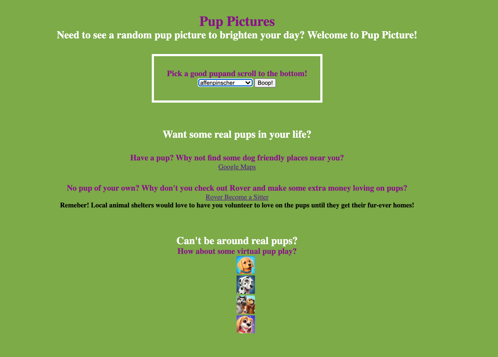
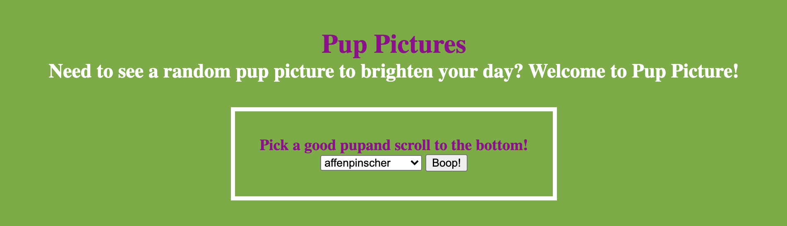
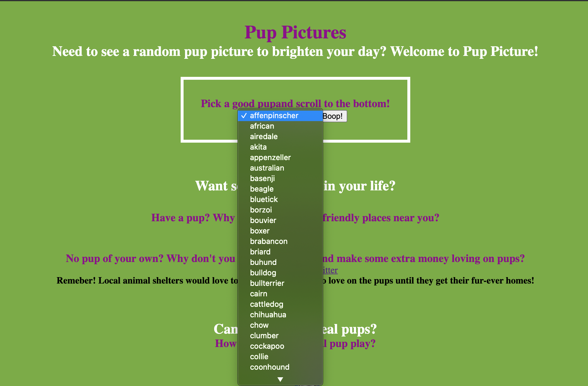
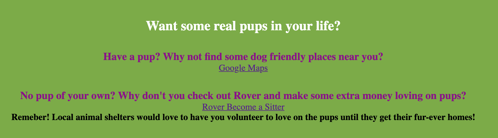
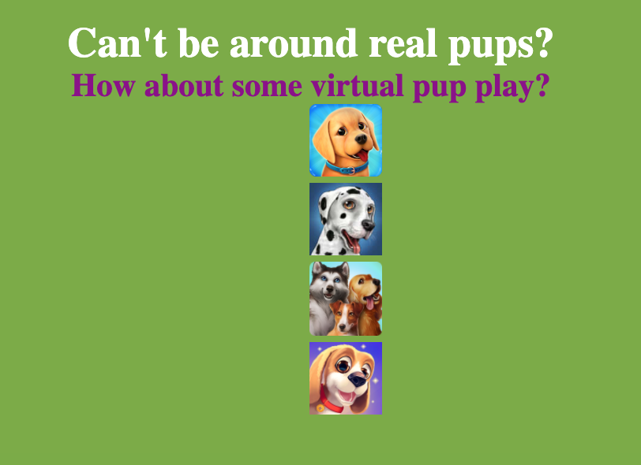

# Pup Pictures

A simple web page for your daily dose of cute pup pictures! 

## Technologies used:
- HTML 5
- CSS 3
- JavaScript
- jQuery 
- Google Fonts
- Dog API
- Dog Town: Pet Shop Game, Care & Play with Dog APP
- DogWorld 3D: My Puppy APP
- DogHotel APP
- TamaDog! - AR Tamagotchi Game APP
- Netlify

## Screen Shots

- Original Design

- Full Site

- Where you pick your pup

- Pull down menu for breed list

- Where you can get some real pup love

- Virtual pup love

## Getting Started
[Click here](https://pup-pictures.netlify.app/) to see deployed app!

## Obsticales
- ~~Getting the app images to appear next to the link.~~ FIXED!
- ~~Last two links for APPS not fully working.~~ FIXED!
- ~~Change API to specific breed and getit to pull up just the picture not link.~~ FIXED!

## Future goals
- ~~Being able to pic a specific breed for random pics!~~ UPDATED!
